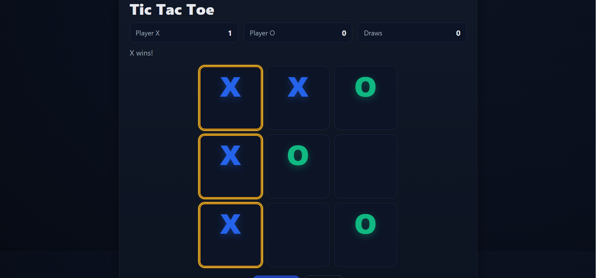

# 🎮 Tic Tac Toe - 2 Player Game

A simple and fun **Tic Tac Toe** game where two players take turns (O and X) on the same device. Built using **HTML**, **CSS**, and **JavaScript**.

---

## 🕹️ Features

- 2-player local gameplay
- Dynamic turn switching (O ↔ X)
- Winner detection
- Reset and New Game buttons
- Minimalist design with smooth UI

---

## 🔗 Live Demo

Play it here: [https://ehsaan-qazi.github.io/tic-tac-toe/](https://ehsaan-qazi.github.io/tic-tac-toe/)  

---



## 🚀 Getting Started

1. **Clone the repository**
   ```bash
   git clone https://github.com/yourusername/tic-tac-toe.git
2. **Open the game**
    Open index.html in any web browser and start playing.
**Project Structure**
tic-tac-toe/
├── index.html     # Game layout
├── style.css      # Game styles
├── script.js      # Game logic
└── README.md      # This file
**🧑‍💻 Author**
Ehsaan ur Rehman
📫 LinkedIn[https://www.linkedin.com/in/ehsaanqazi?utm_source=share&utm_campaign=share_via&utm_content=profile&utm_medium=android_app]
